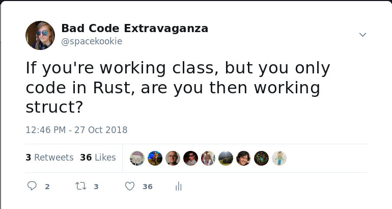
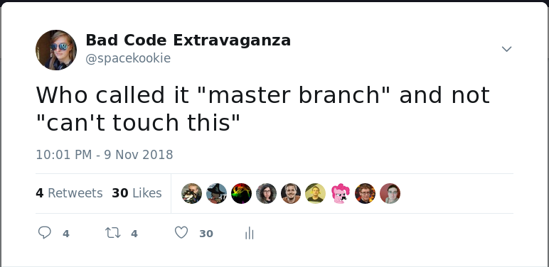
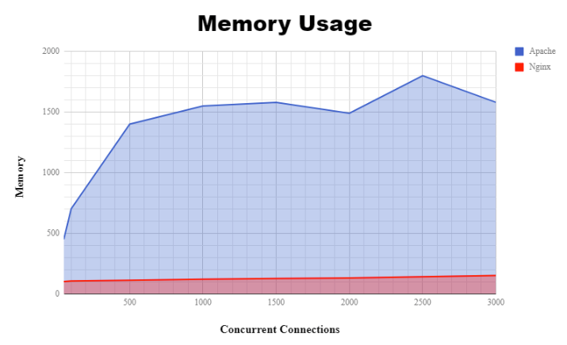
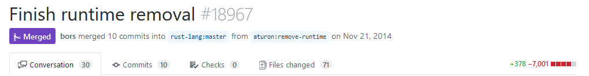

I'm not Florian

---

## `whoami(1)`

Katharina Fey ( `@spacekookie` )

* Active FOSS developer
* Avid tea drinker
* Hobbyist hardware maker 

---

I also make some attrocious puns

---





---

## `whoami(2)`

I do Rust things!

* Contributer of the CLI working group
* Member of the community team & `berlin.rs`
* Maintainer of several `use[ful|less]` libraries

---

## Concurrency is hard

---

*some funny gif*

---

Race conditions

**vs**

Inefficient scaling

---

## Rust

---

> Rust is a systems programming language that runs blazingly fast, prevents segfaults, and guarantees thread safety. 

---


---

## Safety

---

<div class="fragment" data-fragment-index="2">
Memory safety
</div>

<div class="fragment" data-fragment-index="3">
**and**

Thread safety
</div>

---

*xkcd style spectrum of programming languages here*

---

It's about empowering developers

---

> No matter what kind of code you are writing now, Rust empowers you to reach farther, to program with confidence in a wider variety of domains than you did before.

<small>--- Rust book, foreword</small>

---

## Async

---

## What is that?

---

## What does it know?

---

## Let's find out!

---

"Do this thing but don't make me wait"

---

## Futures

---


---

No, not that type of Futures

---

**`Future` = calculation that hasn't happened yet**

> * Is probably gonna happen at some point
> * Just keep asking

---

**Event Loop = runtime for `Future`s**

* Keeps polling `Future` until it is ready
* Runs your code whenever it can be run

---



---

---

I'm here to show code and talk history

<div class="fragment" data-fragment-index="2">
and I'm all out of code
</div>

---

## Late 2013

---

### `libgreen`

---


* Rust had green threading support
* Enabled non-blocking IO

---

Included a runtime in `stdlib`

* This came with a lot of problems

---

Rust wanted to go to different places

---

## Late 2014

---

**`libgreen` is dead, long live `libgreen`**



---

Sorry, did I say ~~libgreen~~, I meant `mio.rs`

---

## `mio.rs`

<small>"Metal IO" 🤘</small>

---

* Light, non-blocking IO library
* Abstracts async over different platforms
* Eventually developed an ecosystem around it

---

---


---

### Zero Cost Abstractions

---

**= no discernible runtime overhead**

---

*something explaining this here*

---

## Mid 2016

---


---

* *zero cost abstraction* for futures
* Building async state-machines

---

### `tokio-core`

---

* Wraps around `mio.rs` and `futures.rs`
* Event reactor

---

## Fast foward to 2018

---

It's state machines all the way down

```rust
let futures = async_a()
                .and_then(|f| {
                    async_b(f.some_data)
                        .and_then(|f| run(f))
                })
                .and_then(|f| async_c(f.some_other_data))
                    .map(|s| process(s))
                    .map_err(|e| handle(e));

// Actually run here
tokio::run(futures);
```

---

## `async` & `await`

---

Write code that looks synchronous but really isn't

```rust
async fn do_this_thing() { ... }

// ...

await!( do_this_thing() );
```

---

**Reminder:** Futures are zero-cost-abstractions.

They disappear from the code at compile-time!

---

## How?!

---

### It's complicated!

<div class="fragment" data-fragment-index="3">
Clever people are working on it
</div>

<div class="fragment" data-fragment-index="4">
In Groups
</div>

<div class="fragment" data-fragment-index="5">
You might even call them "working groups"
</div>


---

## networking-WG

* Implements async/await features in compiler
* Provides library ecosystem

---

## Can I use this?

---

*kinda* 😅

---

### Roadmap

* `async`/`await` syntax in nightly compiler
* library ecosystem is still being polished

Expect more concrete progress early-2019

---

**I don't like answering questions on stage**

---

## You made it!

Follow me on twitter **`@spacekookie`**

Or: **`kookie@spacekookie.de`**

<br/>

#### Thanks to my employers

* I do *Rust* work at **Ferrous Systems**
* I do *Distributed Systems* at **Asquera**