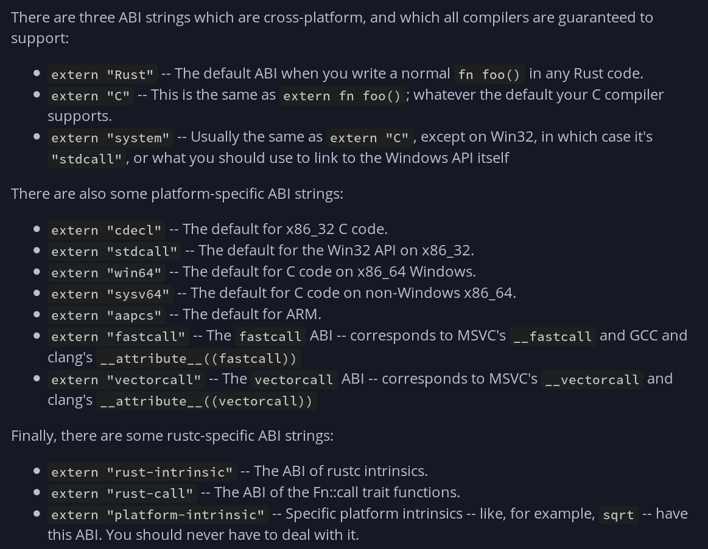
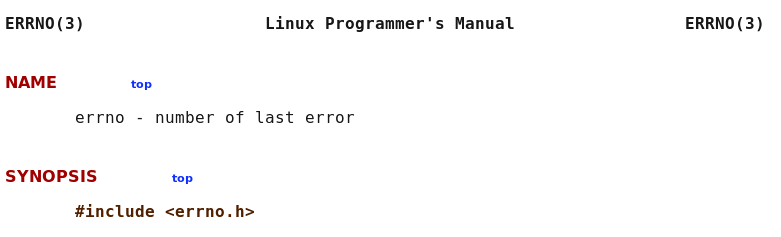
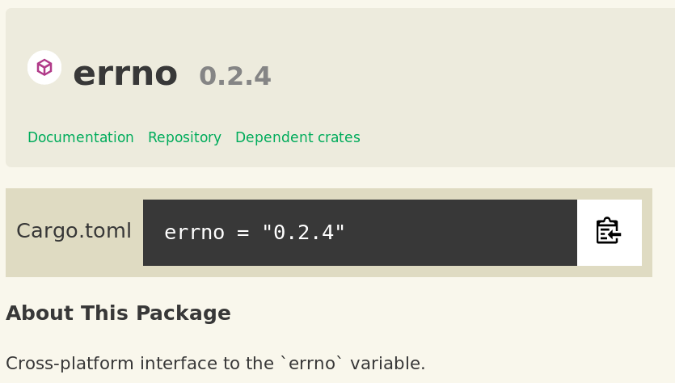

## `whoami(1)`

Katharina Fey (`@spacekookie`)

<br/>

Thanks to

* My company **Ferris Systems**
* Mozilla 🧡

<br/>
<br/>
<br/>
<br/>
<br/>
<br/>
<br/>
<br/>

---

## `whoami(2)`

<br/>


* Contributer to the CLI-WG
* Author of (too) many `use[ful|less]` crates
* Hobbyist hardware maker

<br/>
<br/>
<br/>
<br/>
<br/>
<br/>
<br/>
<br/>

---

## `whoami(3)`

<br/>


* Core contributer to `qaul.net`
  * ~500kloc of C99
  * Primary inspiration for this talk

<br/>
<br/>
<br/>
<br/>
<br/>
<br/>
<br/>
<br/>

---

## Why

<br/>

Rust promises easy FFI to C code

What does this mean?

<div class="fragment" data-fragment-index="2">
What do we *want* it to mean?
</div>

---

## Question time

<br/>

Who here

> * has used `C/C++` in `Rust` code?
> * would call themselves a C developer?
> * would call themselves a C++ developer?

---

## ABI

Application Binary Interface

<br/>

* Defines the function signature (in binary)
* Much like an API but for linkers

---

## ABI

```rust
extern "C" fn foo() { /* ... */ }

#[repr(C)]
struct Bar { /* ... */ }

#[repr(C)]
enum Biz { /* ... */ }

union Fuzz { /* unions are just cool by default */ }
```

---

## ABI



---

## ABI

Let's talk about stability

> * Rust ABI is *not* stable
> * Neither is C++
> * We use C ABI because it's stable

---

## C code from Rust

<br/>
<br/>
<br/>
<br/>
<br/>
<br/>
<br/>
<br/>
<br/>
<br/>
<br/>
<br/>
<br/>
<br/>
<br/>
<br/>
<br/>
<br/>
<br/>
<br/>
<br/>
<br/>
<br/>

---

## Boring FFI

<div class="fragment" data-fragment-index="2">
* Bind to native API with `extern` functions
* Wrap function calls in `unsafe`
* Make data C-compatible
</div>

<div class="fragment" data-fragment-index="3">

```rust
extern "C" {
    fn reverse(const *c_char) -> const *c_char;
}

unsafe fn danger_zone<'a>(value: &'a str) -> &'a str {
    CStr::from_ptr(
        reverse(
            CStr::from(value).unwrap()
        )
    ).to_str()
}
```

</div>

<br/>
<br/>
<br/>


---

## Turning tables

* Take data in C-form
* Use `#[no_mangle]` to preserve the function name
* Same `extern "C"` as before

<div class="fragment" data-fragment-index="2">

```rust
#[no_mangle]
pub extern "C" fn reverse(word: *const c_char) -> *const c_char {
    /* ... implementation really not important right now ... */
}
```

</div>

---

## Turning tables

Some special fields in `Cargo.toml`

```yml
# ...

[lib]
name = "reverso"            # Practise my reversing. Ha-HAA!
crate-type = ["cdylib"]     #  dynamic library (.so)
#            ["staticlib"]     static library (.a)
```

---

## Turning tables

Integrating the Rust code into your build toolchain

```
├── CMakeLists.txt
├── reverso
│   ├── Cargo.toml
│   └── src
│       └── lib.rs
├── reverso.h
└── main.c
```

<div class="fragment" data-fragment-index="2">
Note the header `reverso.h`

```C
// Safely reverse a unicode string
const char *reverse(const char *in);
```

</div>
---

##  Turning tables

Integration into your existing build system

```C
cmake_minimum_required(VERSION 3.11)
execute_process(COMMAND cargo build --release
                WORKING_DIRECTORY reverso)

link_directories("reverso/target/release/")
add_executable(reverse
    main.c
    reverso.h)

target_link_libraries(reverse reverso)
```

---

##  Turning tables

Calling this from C is easy

<!-- char * greeting = "привет RustConf 👩🏽‍💻"; -->

```C
#include "reverso.h"
void main() {
    char * greeting = "привет Afra 👩🏽‍💻";
    printf("'%s' reversed: '%s' \n", greeting, reverse(greeting));
}
```

<div class="fragment" data-fragment-index="2">

<!-- 'привет RustConf 👩🏽‍💻' reversed: '💻👩🏽 fnoCtsuR тевирп' -->
```console
'привет Afra 👩🏽‍💻' reversed: '💻👩🏽 arfA тевирп'
```

</div>

---

## Thank you

Tweet at me @spacekookie

Like, Share & Subscribe...

---

## Alright, not quite

---

## Some Problems

* I don't want to write headers
* How to deal with anything going wrong?
* Oh god, *real* memory management! 😨
* How to build pretty APIs?

---

## Tooling

---

## cbindgen

Don't write headers yourself. Use `cbindgen`

* Like bindgen, but in reverse
* Can generate `.h` files at compile-time

---

## Build system support

---

## Meson

Can build Rust without Cargo

```lua
project("rust shared library", "rust")

l = shared_library("reverso", "reverso.rs", install : true)
```

---

## Erm...b...bash?

---

## Memory management

---

## Memory management

Put your troubles in a box ✨

```rust
#[repr(C)]
struct MyThing {
    /* ... */
}

#[no_mangle]
extern "C" fn make_thing() -> Box<MyThing> {
    Box::new(MyThing {
        /* ... */
    })
}
```

<br/>
<br/>

---

## 📦 Boxes 📦

```rust
pub struct Box<T: ?Sized>(Unique<T>);
```

```rust
pub struct Unique<T: ?Sized> {
    pointer: NonZero<*const T>,
    _marker: PhantomData<T>,
}
```

```rust
pub struct NonZero<T: Zeroable>(pub(crate) T);
```

<br/>
<br/>

---

```rust
let ptr: c_void = /* ... */;

let thing: &mut MyThing = unsafe {
        &mut *ctx as &mut MyThing
    };

thing.foo();
```

---

Remember: C is now responsible for the memory.

*You can't make the native code memory safe*

```C
void main() {
    MyThing *t = make_thing();
    free(t);

    printf("%s", t.value); // kaboom!
}
```

<br/>
<br/>
<br/>
<br/>
<br/>
<br/>
<br/>
<br/>
<br/>

---

```rust
#[no_mangle]
extern "C" fn make_thing() -> Box<MyThing> {
    Box::new(MyThing {
        /* ... */
    })
}
```

---

## Communicating Errors

---

```rust
enum Result<T, E> { /* ... */ }
enum Option<T> { /* ... */ }
```

```rust
fn connect(&mut self) -> Result<Connect, Error>;
fn client(&self) -> Option<&Client>;
```

---

Emulate `Result<T,E>` with a structure

```rust
#[repr(C)]
pub struct rvalue_t {
    thing: Box<Option<Box<Any>>>, // A pointer to something 
                                  //  that might contain a 
                                  //   pointer to anything
    code: u32,
}
```

<div class="fragment" data-fragment-index="2">

C

```C
struct rvalue_t {
    void         *ignore_me;
    unsigned int code;
};
```

</div>

---

```C
rvalue_t val = myfunction();
if (val.code) {
    // Handle errors
}
```

---

> * Errors in C
> * Errors in C++

---

## Errors in C

```C
uint32_t get_client(server_t *ctx, client_t **client);

/* ... */

client_t *client;
ret = get_client(ctx, &client);
if(ret) {
    // Handle errors
}
```

---

## Errors in C

```C
uint32_t initialise(server_t **ctx, uint16_t port);

/* ... */

server_t *server;
ret = initialise(&server, 1337);
if(ret) {
    // Handle errors
}
```

--- 

## Errors in ~~C~~ Rust

```Rust
/// Initialise <thing>
#[no_mangle]
pub extern "C" fn initialise(ctx: *mut *mut c_void, 
                             port: c_uint) -> c_uint {

    /* ... check if port valid ... */ 

    let server = Box::new(server_t { port });
    unsafe { *ctx = Box::into_raw(server) as *mut c_void };
    return 0;
}
```

---

```C
/* rust.h */
struct server_t {
    uint16_t port;
};
uint32_t initialise(struct server_t **, uint16_t);

/* main.c */

struct server_t *server;
uint32_t ret = initialise(&server, 8080);
if(ret) {
    // Handle errors
}
```

---

## That's pretty complicated

---

`errno`

<div class="fragment" data-fragment-index="2">



</div>

---

## errno

* Set `errno` in case of error
* Check for errors with `errno()`

Get human readable string with `strerror(errno)`

---




---

```rust
extern crate errno;
use errno::{Errno, set_errno};

set_errno(12);
```

---

C

```C
pr_mod_ctx ctx; // or *ctx
int ret = proj_module_init(&ctx, a, b, /* ... */);
if (ret) {
    /* Handle error explicitly */
    goto fail;
}
```

```C
ret = proj_module_function(ctx, a, b, /* ... */);
if (ret) {
    /* Handle error explicitly */
    goto fail;
}
```

---

C++

```Cpp
MyObj obj = MyObj::create(a, b, /* .. */);
if (obj == null) {
    /* handle errors explicitly */
}
```

```Cpp
class MyObj {
public:
  MyObj() {
    throw CantBeBotheredException();
  }
}

try {
    MyObj obj = new MyObj(a, b, /* .. */);
} catch (CantBeBotheredException *e) {
    /* handle errors implicitly */
}
```

---

### Can you throw a `C++` exception from Rust?

---

### 😱

---

### Well

---

### That depends...

<div class="fragment" data-fragment-index="2">
* An exception is a setjmp/ longjmp pair on stack
* Compiler swaps `throw` keyword with `libc++` calls
* Those unwind the stack to find a `setjmp` marker
* Resuming execution from that point
</div>

---

### But how?


---

### Exception ABI

```
typedef _Unwind_Reason_Code (*_Unwind_Stop_Fn)
    (int version,
        _Unwind_Action actions,
        uint64 exceptionClass,
        struct _Unwind_Exception *exceptionObject,
        struct _Unwind_Context *context,
        void *stop_parameter );

_Unwind_Reason_Code _Unwind_ForcedUnwind
    ( struct _Unwind_Exception *exception_object,
        _Unwind_Stop_Fn stop,
        void *stop_parameter );
```

---

### Anyway

```rust
/// Ok(...) or Err(...)
fn foo() -> Result<T, Error>;

/// Some(...) or None
fn bar() -> Option<T>;
```

How does `None` compare to `null`?

---

### Emulating `Option<T>`

```rust
fn bar() -> Option<const *c_char> { /* ... */ }
```

```Cpp
char *str = bar();
if(str == null) {
    /* this is None */
}
```

---

### Emulating `Result<T,E>`

* This is a lot harder
* There are `C++` implementations of `Result`

---

### So what about C?

```C
int ret = some_rust_function(&ctx, "abc", 42);
```

C pointers become `const *c_void`

```rust
#[no_mangle]
extern "C" fn some_rust_function(
    ctx: const *c_void, 
    s: const *c_char, 
    num: uint32_t)
{
    /* ... */
}

```

--- 

But: `c_void` just refers to a Rust type, right?

```rust
#[no_mangle]
extern "C" fn some_rust_function(
   /* ... */
{
    let ctx: &mut MyState = unsafe {
        &mut *ctx as &mut MyState
    };

    ctx.some_mut_function();
}
```

---

### Generating headers

* `cbindgen` generates C-headers from Rust code
* Can be hooked into the build-pipline
  * Don't keep headers in the repo – generate them!

---

### Some thoughts on linking

* Rust links statically by default
* Each `foo.so` would be several MB big!
* `-C prefer-dynamic` to the rescue
  * Dynamically link libraries
  * Requires you to link them together yourself in your build pipeline